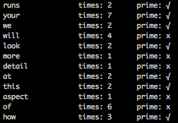

##BookParsing
This program elaborates a text file by stripping out punctuation, splitting and listing every word and counting how many times a word appears.
The program also checks if the number of times a word appears is a prime number.



##Technologies
| Language | Testing |
| -------- | ------- |
| C#       | Nunit   |

##How to run it
Clone the repository
```
SSH:
$ git clone git@github.com:matteomanzo/BookParsing_Csharp.git
HTTPS:
$ git clone https://github.com/matteomanzo/BookParsing_Csharp.git
```
Change into the directory
```
$ cd BookParsing_Csharp/BookParsing
```
You should have Mono frameqork installed, if you don't, go [here](http://www.mono-project.com/download/) and download it. <br/>
Compile the file running
```
mcs Program.cs ElaborateText.cs PrimeNumber.cs
```
And execute it with
```
mono Program.exe
```
Run the tests opening the `BookParsing.sln` file on Xamarin and `Run unit tests`.

##Thoughts on the project
Keeping the methods short it is very hard using a strong typed language like C#. At the same time though, typing what kind of input and output you want to manipulate helps a lot about thinking how to the design the app.
It was very challenging to test drive as I wasn't totally familiar with this language but I found very interesting the way NUnit works.
